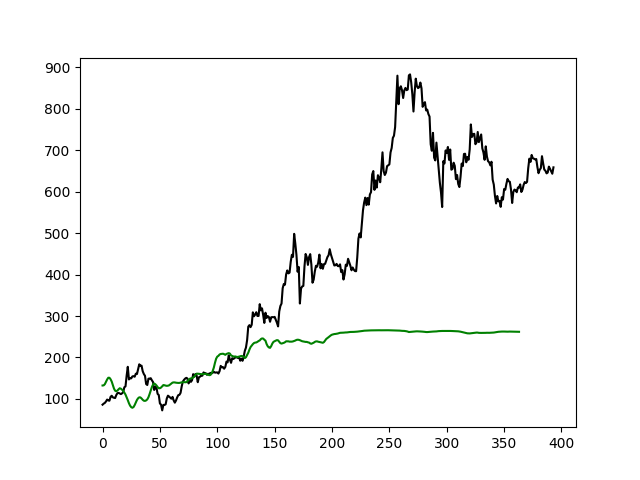
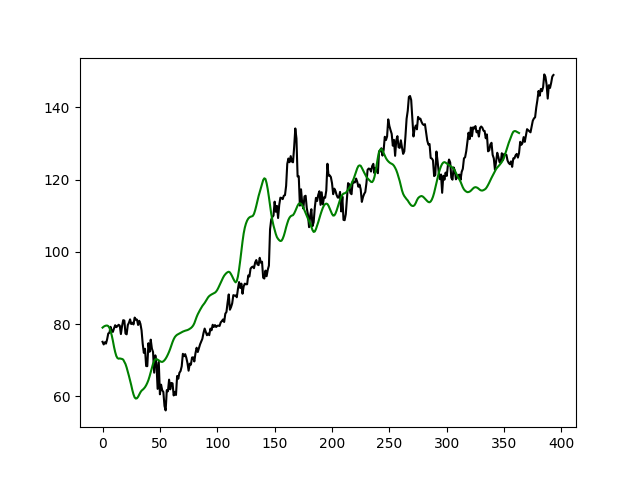

# Stock Prediction App

<b><h2>This project is not meant to be used as an investment tool.</h2></b>

Project uses ML techniques to predict future values of stocks. In order to do this, it involves LSTM Network Architecture and data from <i>Yahoo Finance API</i>.

<br />

## Table of Contents

1. [Project Requirements](#project-requirements)
2. [Run Application](#run-application)
3. [Popular stock ticker symbols](#popular-stock-ticker-symbols)
4. [Insights overview](#insights-overview)

<br />

## Project Requirements

The following software requires following modules to be installed. Please see <b><i>requirements.txt</i></b>, or install all modules using the command:

```
pip install -r requirements.txt
```

<br />

## Run Application

To use the software, run the following command:

```
python main.py <stock-ticker-symbol>
```

<br /> 

## Popular stock ticker symbols

<br />

<table id="ticker-symbols" align="center">
  <tr>
    <th>Company</th>
    <th>Ticker Symbol</th>
  </tr>
  <tr>
    <td>Microsoft Corporation</td>
    <td>MSFT</td>
  </tr>
  <tr>
    <td>Intel Corporation</td>
    <td>INTC</td>
  </tr>
  <tr>
    <td>Apple</td>
    <td>AAPL</td>
  </tr>
  <tr>
    <td>General Motors</td>
    <td>GN</td>
  </tr>
  <tr>
    <td>Alphabet (GOOGLE)</td>
    <td>GOOG</td>
  </tr>
  <tr>
    <td>NVIDIA Corporation</td>
    <td>NVDA</td>
  </tr>
</table>

<br /><br />

## Insights overview
<br />
<p>
This stock prediction app analyzes the previous changes in the company's stock value. The model is trained on data reaching deep into past 10 years. <br />

Model surprisingly manages to predict the shape of future stock plot, but it does not apply to every company.
There are several factors that influence the deceitfulness of this prediction app. One of them is the <b>changing popularity of the company</b>. <br />
See for example <b>TESLA</b>, which is most definitely a successful business whose main founder (Elon Musk) is a very popular celebrity on the social media. His latest posts (tweets) can affect the stock price of "his" company.

Here is the validation of the predicted model for the period of 2020.01 - 2021.07. Black lines indicates the real past values, green are the predicted ones for that period. 
</p>

<div align="center">

</div><br />

<p>
It is clearly visible that the model doesn't include some important factor(s) that lead to the false predictions. The event that is probably shown on the plot might have been introduction of the new tesla car or some other technology related to car's autonomy.
Of course there are many more reasons why this stock validation was false (e.g. company innovations).
</p>

<br />

<p>
On the other hand, there are companies that experience increase in some periods. E.g Apple as a big tech company releases new products mostly at the same time intervals (e.g. )

<table id="ticker-symbols" align="center">
  <tr>
    <th>iPhone 13 (predicted)</th>
    <th>September 7 / 14, 2021</th>
  </tr>
  <tr>
    <td>iPhone 12 + 12 Pro</td>
    <td>October 13, 2020</td>
  </tr>
  <tr>
    <td>iPhone 11 series</td>
    <td>September 10, 2019</td>
  </tr>
  <tr>
    <td>iPhone XS series</td>
    <td>September 12, 2018</td>
  </tr>
  <tr>
    <td>iPhone 8 series</td>
    <td>September 12, 2017</td>
  </tr>
</table>

<br />

It might be the reason why the predicted validation of the past year's data came out well enough.<br /><br />

</p>

<div align="center">

</div>
<br /><br />

<p>

Another common factor that leads this model to false predictions, is the lack of the ability to predict <b>future 
demand</b>. Without a doubt we can see that the covid-19 pandemic affected many sectors of technology industry. One of the effects of the pandemic was increased demand on technology hardware that caused <a href="https://en.wikipedia.org/wiki/2020–21_global_chip_shortage" target="_blank">Global Chip Shortage of 2020-21</a>. 
Companies whose profits are based on production of such technologies experienced increased in its stocks value. <br />
Events like this might introduce some misstatements into the prediction model.
</p>
